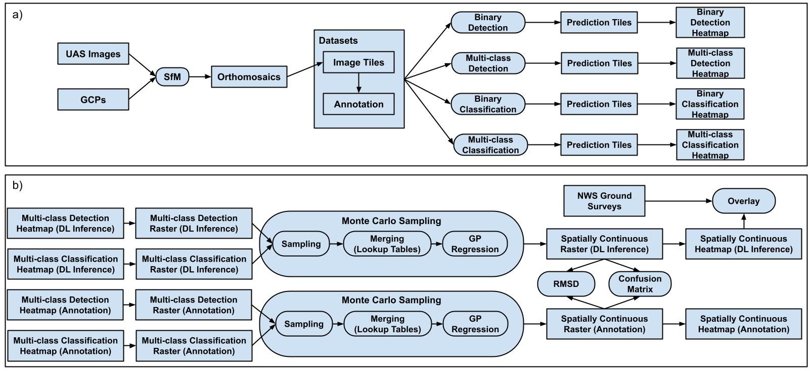
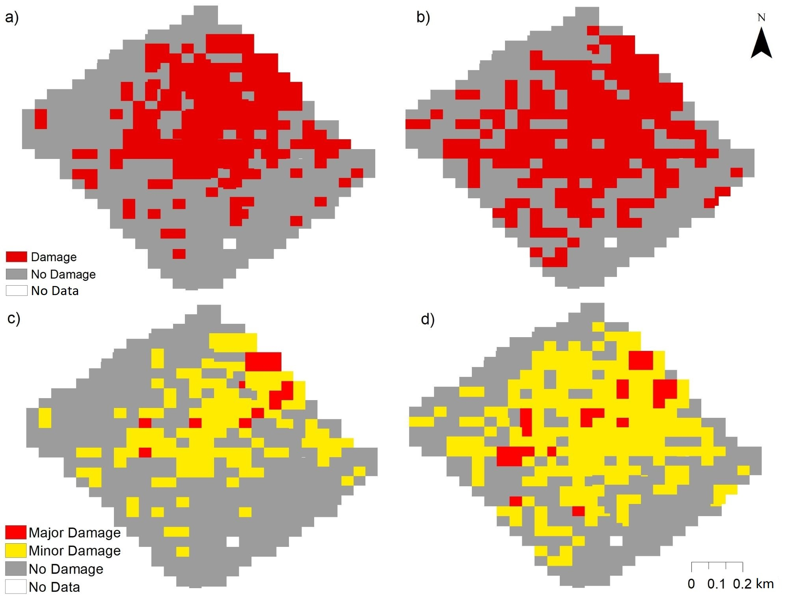
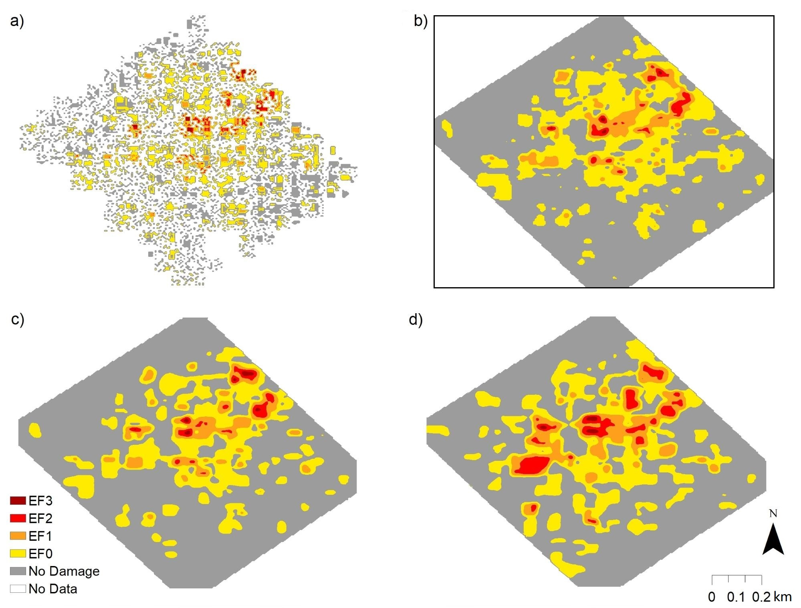

# tornado_ML
Data-driven approaches for tornado damage estimation with UAS

### Workflow


### Content List
1. Data pre-processing: data_augmentor
2. Object detection: mask_rcnn_pytorch
3. image classification: image_classification
4. Gaussian process regression: tornado_gp
5. Data post-processing: post_processing

### Results
1. Object detection samples


2. Image classification heatmap



3. Gaussian process regression heatmap


### Publication
[Chen, Z., Wagner, M., Das, J., Doe, R.K. and Cerveny, R.S., 2021. Data-Driven Approaches for Tornado Damage Estimation with Unpiloted Aerial Systems. Remote Sensing, 13(9), p.1669.](https://www.mdpi.com/2072-4292/13/9/1669)
```
@article{chen2021data,
  title={Data-Driven Approaches for Tornado Damage Estimation with Unpiloted Aerial Systems},
  author={Chen, Zhiang and Wagner, Melissa and Das, Jnaneshwar and Doe, Robert K and Cerveny, Randall S},
  journal={Remote Sensing},
  volume={13},
  number={9},
  pages={1669},
  year={2021},
  publisher={Multidisciplinary Digital Publishing Institute}
}
```

### Data availability
The image data presented in this study contains sensitive residential information, and will be made available on request only for research purpose.

### Contact
Zhiang Chen, zch at asu dot edu.

